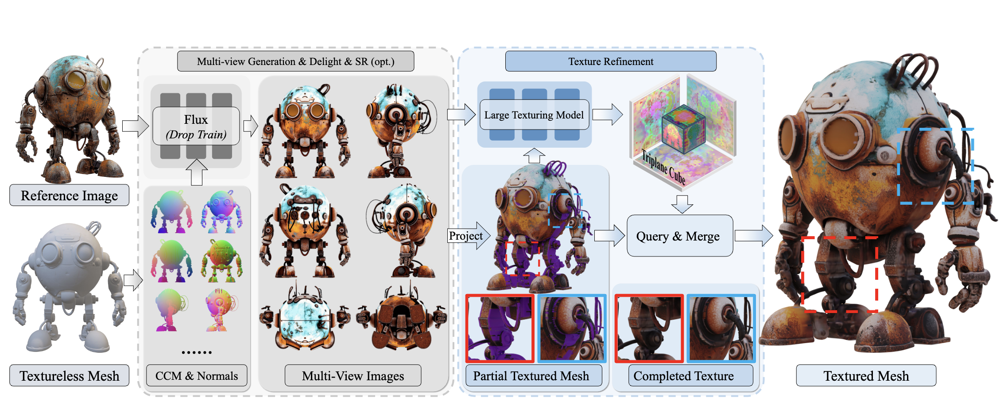

# UniTEX: Universal High Fidelity Generative Texturing for 3D Shapes

[Yixun Liang](https://yixunliang.github.io/)$^{\*}$ [Kunming Luo](https://coolbeam.github.io)$^{{\*}}$, [Xiao Chen]()$^{{*}}$, [Rui Chen](https://aruichen.github.io), [Hongyu Yan](https://scholar.google.com/citations?user=TeKnXhkAAAAJ&hl=zh-CN), [Weiyu Li](https://weiyuli.xyz),[Jiarui Liu](), [Ping Tan](https://pingtan.people.ust.hk/index.html)$†$

$\*$: Equal contribution. $†$: Corrsponding author.


<a href="https://arxiv.org/abs/2505.23253"></a> 
---
## :tv: Video
</div>
<div align=center>

[](https://youtu.be/O8G1XqfIxck "UniTEX: Universal High Fidelity Generative Texturing for 3D Shapes")

Please click to watch the 3-minute video introduction of our project.

</div>

## 🎏 Abstract

We present a 2 stage texturing framework, named the *UniTEX*, to achieve high-fidelity textures from any 3D shapes.

<details><summary>CLICK for the full abstract</summary>

> We present UniTEX, a novel two-stage 3D texture generation framework to create high-quality, consistent textures for 3D assets.
Existing approaches predominantly rely on UV-based inpainting to refine textures after reprojecting the generated multi-view images onto the 3D shapes, which introduces challenges related to topological ambiguity. To address this, we propose to bypass the limitations of UV mapping by operating directly in a unified 3D functional space. Specifically, we first propose a novel framework that lifts texture generation into 3D space via Texture Functions (TFs)—a continuous, volumetric representation that maps any 3D point to a texture value based solely on surface proximity, independent of mesh topology. Then, we propose to predict these TFs directly from images and geometry inputs using a transformer-based Large Texturing Model (LTM). To further enhance texture quality and leverage powerful 2D priors, we develop an advanced LoRA-based strategy for efficiently adapting large-scale Diffusion Transformers (DiTs) for high-quality multi-view texture synthesis as our first stage. Extensive experiments demonstrate that UniTEX achieves superior visual quality and texture integrity compared to existing approaches, offering a generalizable and scalable solution for automated 3D texture generation.

</details>

<div align=center>
  
</div>
## 🚧 Todo

- [ ] Release the basic texturing codes and flux checkpoints (lora)
- [ ] Release the training code of flux
- [ ] Release LTM checkpoints

## 🔧 Installation
Comming soon!

## 🔧 How to use？
Comming soon!

## 📍 Citation 
If you find this project useful for your research, please cite: 

```
@article{liang2025UnitTEX,
  title={UniTEX: Universal High Fidelity Generative Texturing for 3D Shapes},
  author={Yixun Liang and Kunming Luo and Xiao Chen and Rui Chen and Hongyu Yan and Weiyu Li and Jiarui Liu and Ping Tan},
  journal={arXiv preprint arXiv:2505.23253},
  year={2025}
}
```
## 7. Acknowledgments
We would like to thank the following projects: [FLUX](https://github.com/black-forest-labs/flux), [DINOv2](https://github.com/facebookresearch/dinov2), [CLAY](https://arxiv.org/abs/2406.13897), [Michelango](https://github.com/NeuralCarver/Michelangelo), [CraftsMan3D](https://github.com/wyysf-98/CraftsMan3D), [TripoSG](https://github.com/VAST-AI-Research/TripoSG), [Dora](https://github.com/Seed3D/Dora), [Hunyuan3D 2.0](https://github.com/Tencent/Hunyuan3D-2), [FlashVDM](https://github.com/Tencent/FlashVDM)
, [diffusers](https://github.com/huggingface/diffusers) and [HuggingFace](https://huggingface.co) for their open exploration and contributions. We would also like to express our gratitude to the closed-source 3D generative platforms [Tripo](https://www.tripo3d.ai/), [Rodin](https://hyper3d.ai/), and [Hunyuan2.5](https://3d.hunyuan.tencent.com/) for providing such impressive geometry resources to the community. We sincerely appreciate their efforts and contributions.