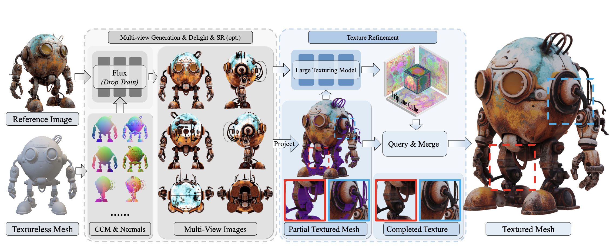

# UniTEX: Universal High Fidelity Generative Texturing for 3D Shapes

[Yixun Liang](https://yixunliang.github.io/)$^{\*}$, [Kunming Luo](https://coolbeam.github.io)$^{{\*}}$, [Xiao Chen]()$^{{*}}$, [Rui Chen](https://aruichen.github.io), [Hongyu Yan](https://scholar.google.com/citations?user=TeKnXhkAAAAJ&hl=zh-CN), [Weiyu Li](https://weiyuli.xyz),[Jiarui Liu](), [Ping Tan](https://pingtan.people.ust.hk/index.html)$†$

$\*$: Equal contribution. $†$: Corrsponding author.

The paper is now accepted to CVPR 2026. 

<a href="https://arxiv.org/abs/2505.23253"></a> 
---
## :tv: Video
</div>
<div align=center>

[](https://youtu.be/O8G1XqfIxck "UniTEX: Universal High Fidelity Generative Texturing for 3D Shapes")

Please click to watch the 3-minute video introduction of our project.

</div>

## 🎏 Abstract

We present a 2 stage texturing framework, named the *UniTEX*, to achieve high-fidelity textures from any 3D shapes.

<details><summary>CLICK for the full abstract</summary>

> We present UniTEX, a novel two-stage 3D texture generation framework to create high-quality, consistent textures for 3D assets.
Existing approaches predominantly rely on UV-based inpainting to refine textures after reprojecting the generated multi-view images onto the 3D shapes, which introduces challenges related to topological ambiguity. To address this, we propose to bypass the limitations of UV mapping by operating directly in a unified 3D functional space. Specifically, we first propose a novel framework that lifts texture generation into 3D space via Texture Functions (TFs)—a continuous, volumetric representation that maps any 3D point to a texture value based solely on surface proximity, independent of mesh topology. Then, we propose to predict these TFs directly from images and geometry inputs using a transformer-based Large Texturing Model (LTM). To further enhance texture quality and leverage powerful 2D priors, we develop an advanced LoRA-based strategy for efficiently adapting large-scale Diffusion Transformers (DiTs) for high-quality multi-view texture synthesis as our first stage. Extensive experiments demonstrate that UniTEX achieves superior visual quality and texture integrity compared to existing approaches, offering a generalizable and scalable solution for automated 3D texture generation.

</details>

<div align=center>
  
</div>

## 🚧 Todo

- [x] Release the basic texturing codes with flux lora checkpoints
- [x] Release the training code of flux (lora) ([UniTEX-FLUX](https://github.com/lightillusions/UniTEX-FLUX))
- [x] Release LTM checkpoints. (we also refine the codebase, make that our code can download checkpoints automatically)

## 🔧 Installation

run  ```bash env.sh``` to prepare your environment.


We also provide a step-by-step guide to install the dependencies via ```requirements.txt```:
```
conda create -n unitex python=3.10 --yes
conda activate unitex
conda install cudatoolkit=11.8 --yes # check nvcc -V, it should be 11.8
pip install torch==2.4.1 torchvision==0.19.1 torchaudio==2.4.1 --index-url https://download.pytorch.org/whl/cu118
pip install kaolin -f https://nvidia-kaolin.s3.us-east-2.amazonaws.com/torch-2.4.1_cu118.html
pip install -r requirements.txt
pip install git+https://github.com/NVlabs/nvdiffrast.git --no-build-isolation
```

If you meet the issues about slangtorch, just try to replace the previous slangtorch with this specific version: ```slangtorch==1.2.0```

**Note** We noticed that some users encountered errors when using slangtorch==1.3.7. If you encounter the same issue, you can try reinstalling slangtorch==1.3.4, which should resolve the problem. (Check [This issue](https://github.com/lightillusions/UniTEX/issues/2#issuecomment-2939913090), it also about how to use our repo under cu121, thanks to [HwanHeo](https://github.com/hwanhuh))

## How to use？
Run the following code, code will download checkpoints automatically:
```
from pipeline import CustomRGBTextureFullPipeline
import os
rgb_tfp = CustomRGBTextureFullPipeline(super_resolutions=False,
                                        filt_gradient_points=False,
                                        filt_large_angle_points=True,
                                        seed = 63)

test_image_path = {your reference image}
test_mesh_path = {your input mesh}
save_root = 'outputs/{your save folder}'
os.makedirs(save_root, exist_ok=True)
rgb_tfp(save_root, test_image_path, test_mesh_path, clear_cache=False)
```

you can also use
```
python run.py
```
to run our given example.

SR:
if you want to use super_resolutions, prepare the ckpts of SR model [TSD_SR](https://github.com/Microtreei/TSD-SR) 
and change the default dir in `` TSD_SR/sr_pipeline.py ln 30-32``
```
parser.add_argument("--pretrained_model_name_or_path", type=str, default="stabilityai/stable-diffusion-3-medium-diffusers/", help='path to the pretrained sd3')
parser.add_argument("--lora_dir", type=str, default="your_lora_dir", help='path to tsd-sr lora weights')
parser.add_argument("--embedding_dir", type=str, default="your_emb_dir", help='path to prompt embeddings')
```

Then, tune ``super_resolutions``  in ``run.py`` to true.

## Some dilation tricks of inpainting
During inpainting, we provide two additional point filtering tricks:

``filt_large_angle_points``: Enabled by default in LTM. Filters out points where the angle between the model normal and the rendering view direction is too large.

``filt_gradient_points``: We observed that fine-grained high-frequency details often mismatch, especially after super-resolution (SR). This filter removes projected points in high‑frequency regions based on image gradient and fills them via inpainting. Note that this filter removes all high‑frequency details indiscriminately, so enabling it may reduce fine details. Since LTM generation is inherently less sharp than inpainting-based results, you can choose whether to enable it based on your needs.

You can open them when initializing the pipeline, just like shown in ``run.py``.


## Training your own FLUX lora
We also provide training code for texture generation and de-lighting, which can be adapted for other tasks as well. Please refer to ([UniTEX-FLUX](https://github.com/lightillusions/UniTEX-FLUX)) for more details.

## 📍 Citation 
If you find this project useful for your research, please cite: 

```
@article{liang2025UnitTEX,
  title={UniTEX: Universal High Fidelity Generative Texturing for 3D Shapes},
  author={Yixun Liang and Kunming Luo and Xiao Chen and Rui Chen and Hongyu Yan and Weiyu Li and Jiarui Liu and Ping Tan},
  journal={arXiv preprint arXiv:2505.23253},
  year={2025}
}
```
## 7. Acknowledgments
We would like to thank the following projects: [FLUX](https://github.com/black-forest-labs/flux), [DINOv2](https://github.com/facebookresearch/dinov2), [CLAY](https://arxiv.org/abs/2406.13897), [Michelango](https://github.com/NeuralCarver/Michelangelo), [CraftsMan3D](https://github.com/wyysf-98/CraftsMan3D), [TripoSG](https://github.com/VAST-AI-Research/TripoSG), [Dora](https://github.com/Seed3D/Dora), [Hunyuan3D 2.0](https://github.com/Tencent/Hunyuan3D-2), [TSD_SR](https://github.com/Microtreei/TSD-SR),[Cosmos Tokenizer](https://github.com/NVIDIA/Cosmos-Tokenizer), [diffusers](https://github.com/huggingface/diffusers) and [HuggingFace](https://huggingface.co) for their open exploration and contributions. We would also like to express our gratitude to the closed-source 3D generative platforms [Tripo](https://www.tripo3d.ai/), [Rodin](https://hyper3d.ai/), and [Hunyuan2.5](https://3d.hunyuan.tencent.com/) for providing such impressive geometry resources to the community. We sincerely appreciate their efforts and contributions.
